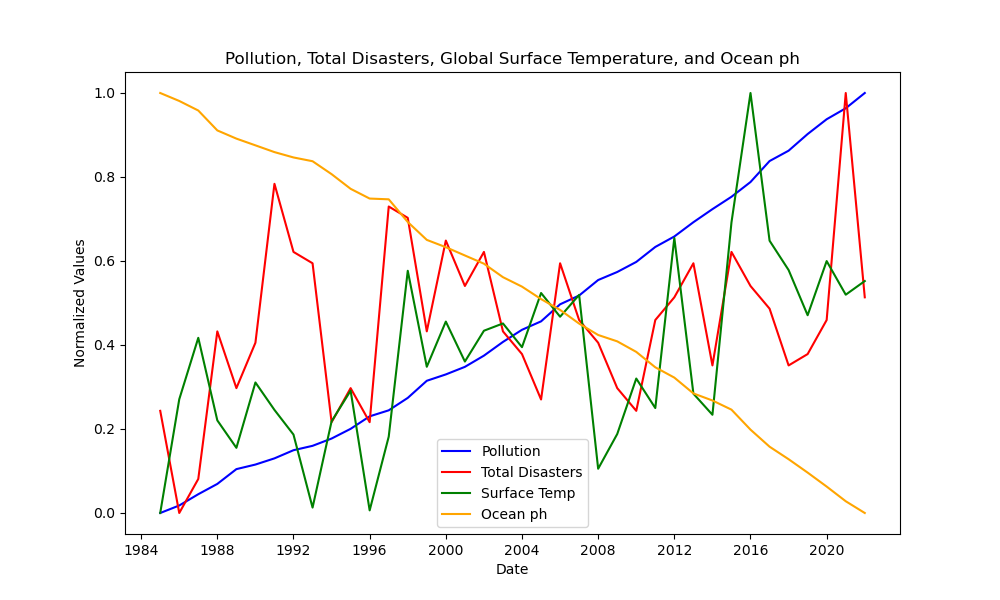
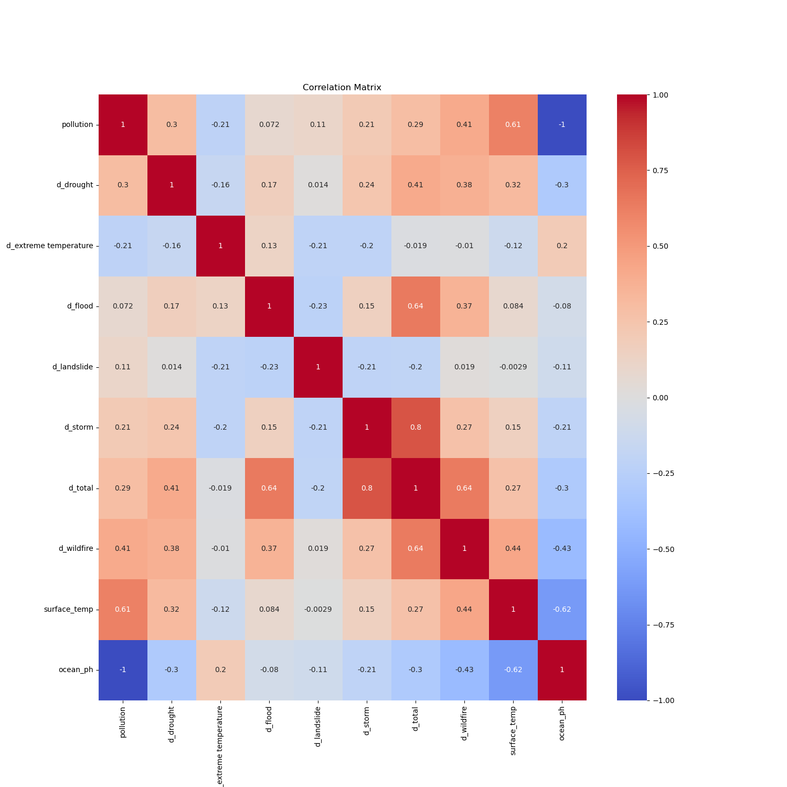
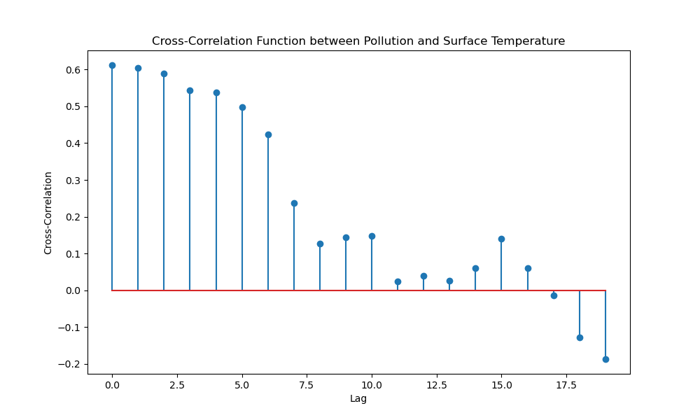
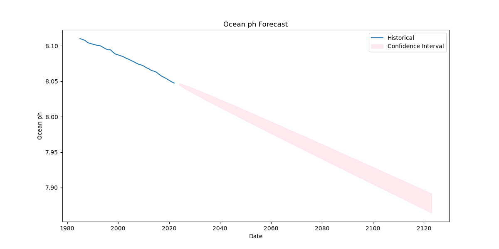

# Climate Analysis Project

## About

In this project, we analyze climate and ecology data from several sources. The goal is to showcase machine learning methods like time series forecasting, correlation.

In this repository, we enable the synthesis of several different datasets and draw conclusions about causality, predict future values, assess environmental risks, and propose data-driven solutions for sustainability. 

#### Pollution data (CO2 ppm)
https://climatedata.imf.org/pages/climatechange-data#cc3

Provided by National Oceanic and Atmospheric Association Global Monitoring Laboratory.

#### Natural disaster count
https://climatedata.imf.org/pages/climatechange-data#cc3

Provided by Food and Agriculture Organization Corporate Statistical Database (FAOSTAT).

#### Global surface temperature
https://climatedata.imf.org/pages/climatechange-data#cc3

Provided by EM-DAT, The international disaster database.

#### Ocean ph levels

https://marine.copernicus.eu/access-data/ocean-monitoring-indicators/global-ocean-acidification-mean-sea-water-ph-time-series

E.U. Copernicus Marine Service Information.

## Setup

Have `conda` installed.

`conda env create --name climate --file=env.yml`

Install the `climate_analysis` package.

`pip install -e .`

## Reslults and Potential Solutions

Below are plots generated with the code, their interpretation, and data-driven solutions for sustainability.

We can normalize the values of each of the variables over time to gain insight into their relationships. Clearly, the pollution (CO2 ppm) is inversely proportional to the ocean ph levels. The total number of natural disasters each year and the surface temperature also indicate an increasing trend from 1984 to present day.

Here we have the correlation matrx of each of the variables, both normalized and in their raw format. We see that variable pairs with higher correlation magnitude include (ocean ph, surface temp), (surface temp, pollution), and (ocean ph, pollution). The correlation between pollution and ocean ph levels is the most significant, with a very strong inverse correlation.

Cross correlation shows us the different correlation factors over different lag periods (years). We see that there is a monotonically decreasing correlation at the start, implying that there is no lag between these variables.

According to the ARIMA forecasting model, the ocean ph confidence interval in 2050 will be between 7.99 and 8.01. 

According to the ARIMA forecasting model, the pollution interval in 2050 will be between 461 and 509 co2 ppm. 

We can draw some meaningful conclusions from this data. At an ocean ph level of 8.0, many organisms will be affected, including the coral reefs. At higher ph levels, these organisms will not be able to survive, leading to poor coastal management and destruction of fish habitat. Because of the high correlation we see with pollution levels, this could be the first step taken to resolve the ocean acidification. 

Further, the surface temperature of the earth is gradually rising as pollution levels increase. 

This data analysis supports the common belief that pollution levels and greenhouse gas levels in the atmosphere are leading to ocean adicification and an increase in earth surface temperature. 

One way to reduce the pollution levels is to offer stronger incentives to companies for carbon capture. Another is for cities to invest in public transit to reduce the vehicles on the road.
